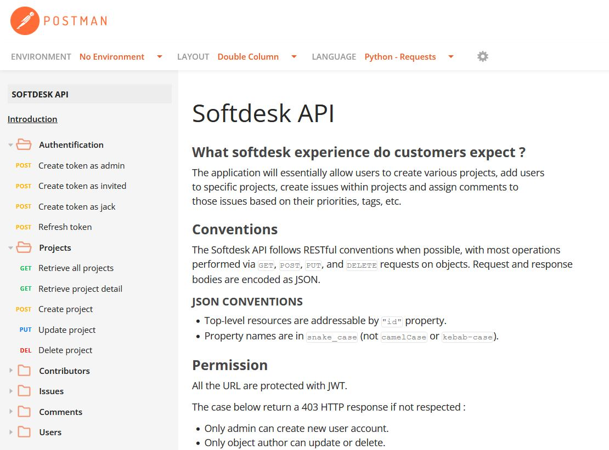
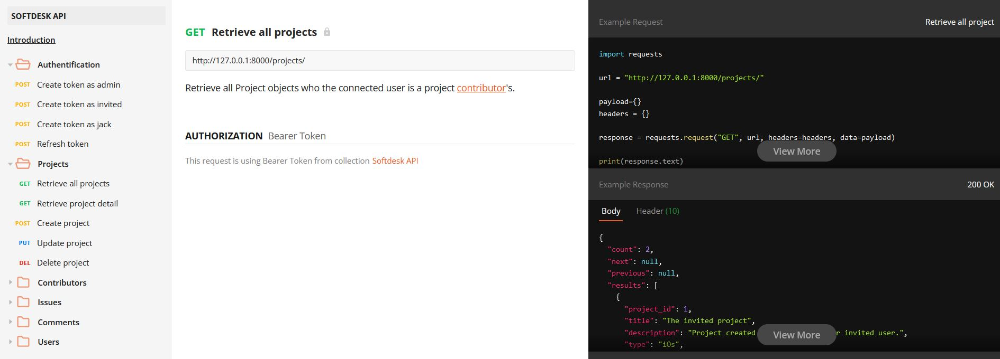

<div id="top"></div>


<!-- PROJECT LOGO -->
<br/>
<div align="center">
  <a href="https://github.com/KDerec/softdesk/blob/master/images/logo.png">
    
  </a>

<h3 align="center">RESTful API using Django REST</h3>
  <p align="center">
    This student project is the #7 of my training.<br>You can follow the previous <a href="https://github.com/KDerec/litreview">here</a> and next one <a href="https://github.com/KDerec/Python_Testing">here</a>.
  </p>
</div>


<!-- TABLE OF CONTENTS -->
<details>
  <summary>Table of Contents</summary>
  <ol>
    <li><a href="#about-the-project">About The Project</a></li>
    <li><a href="#built-with">Built With</a></li>
    <li><a href="#installation">Installation</a></li>
    <li><a href="#license">License</a></li>
    <li><a href="#contact">Contact</a></li>
  </ol>
</details>


<!-- ABOUT THE PROJECT -->
## About The Project
[The API documentation](https://documenter.getpostman.com/view/22236994/VUqpudLA) is created with Postman. 
### 🌱 Developped skills
- Creating a RESTful API with Django REST
- Securing an API to comply with OWASP and RGPD standards
- Documenting an application
### ⚠ Caution 
For the sample, the current database already has created objects, like user accounts, projects, contributors, ...  
You **must change the admin account** to fill with your requirements and you can delete the others objects or update it at your convenience.  
To manipulate the objects of the database, you can use the Django admin site with /admin/ path.
### 🚀 Project goal
The application will essentially allow users to create various [project](https://documenter.getpostman.com/view/22236994/VUqpudLA#fb869c28-85b7-4402-a9c3-a48ad4776f8a), add [users](https://documenter.getpostman.com/view/22236994/VUqpudLA#71aa833c-82bc-4b37-b041-e83980e92c18)
to specific projects (called a [contributor](https://documenter.getpostman.com/view/22236994/VUqpudLA#f5a1c04d-84f0-4d21-91c8-7a59a28eff6a)), create [issues](https://documenter.getpostman.com/view/22236994/VUqpudLA#dc38e059-87fd-4c00-8e08-49da9ef83f97) within projects and assign [comments](https://documenter.getpostman.com/view/22236994/VUqpudLA#0c20dcc0-d910-4a83-aecd-69f735812786) to
those issues based on their priorities, tags, etc.

### API documentation sample ([complete here](https://documenter.getpostman.com/view/22236994/VUqpudLA)):
<a href="https://github.com/KDerec/softdesk/blob/master/images/postman_doc_1.JPG">
    
</a>  

___

<a href="https://github.com/KDerec/softdesk/blob/master/images/postman_doc_2.JPG">
    
</a>  
<p align="right">(<a href="#top">back to top</a>)</p>


### Built With
* [Python](https://www.python.org/)
* [Django](https://www.djangoproject.com/)
* [Django REST](https://www.django-rest-framework.org/)
* [Postman](https://www.postman.com/)

<p align="right">(<a href="#top">back to top</a>)</p>


## Installation
1. <a href="#python-installation">Install Python</a> ;
2. Clone the project in desired directory ;
   ```sh
   git clone https://github.com/KDerec/softdesk.git
   ```
3. Change directory to project folder ;
   ```sh
   cd path/to/softdesk
   ```
4. Create a virtual environnement *(More detail to [Creating a virtual environment](https://packaging.python.org/en/latest/guides/installing-using-pip-and-virtual-environments/#creating-a-virtual-environment))* ;
    * For Windows :
      ```sh
      python -m venv env
      ```
    * For Linux :
      ```sh
      python3 -m venv env
      ```
5. Activate the virtual environment ;
    * For Windows :
      ```sh
      .\env\Scripts\activate
      ```
    * For Linux :
      ```sh
      source env/bin/activate
      ```
6. Install package of requirements.txt ;
   ```sh
   pip install -r requirements.txt
   ```
7. Run the server by executing the command ;
    * By default  :
      ```sh
      python manage.py runserver
      ```
    * Or for a different port, for example, 8080 :
      ```sh
      python manage.py runserver 8080
      ```
8. Follow the [API documentation](https://documenter.getpostman.com/view/22236994/VUqpudLA) to learn how to use the API.
9. Enjoy the API.


<p align="right">(<a href="#top">back to top</a>)</p>


### Python installation
1. Install Python. If you are using Linux or macOS, it should be available on your system already. If you are a Windows user, you can get an installer from the Python homepage and follow the instructions to install it:
   - Go to [python.org](https://www.python.org/)
   - Under the Download section, click the link for Python "3.xxx".
   - At the bottom of the page, click the Windows Installer link to download the installer file.
   - When it has downloaded, run it.
   - On the first installer page, make sure you check the "Add Python 3.xxx to PATH" checkbox.
   - Click Install, then click Close when the installation has finished.

2. Open your command prompt (Windows) / terminal (macOS/ Linux). To check if Python is installed, enter the following command (this should return a version number.):
   ``` sh
   python -V
   # If the above fails, try:
   python3 -V
   # Or, if the "py" command is available, try:
   py -V
   ```

<p align="right">(<a href="#top">back to top</a>)</p>


<!-- LICENSE -->
## License
Distributed under the MIT License. See `LICENSE` for more information.

<p align="right">(<a href="#top">back to top</a>)</p>


<!-- CONTACT -->
## Contact
Kévin Dérécusson - kevin.derecusson@outlook.fr

Project Link: [https://github.com/KDerec/softdesk](https://github.com/KDerec/softdesk)

<p align="right">(<a href="#top">back to top</a>)</p>


<i>This student project is the #7 of my training.<br>You can follow the previous <a href="https://github.com/KDerec/litreview">here</a> and next one is in progress.</i>
